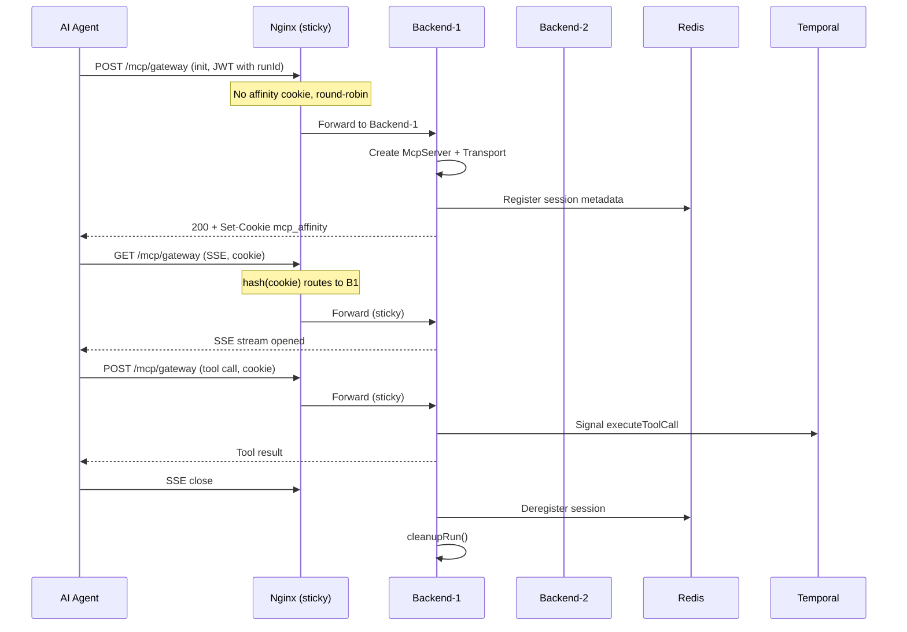
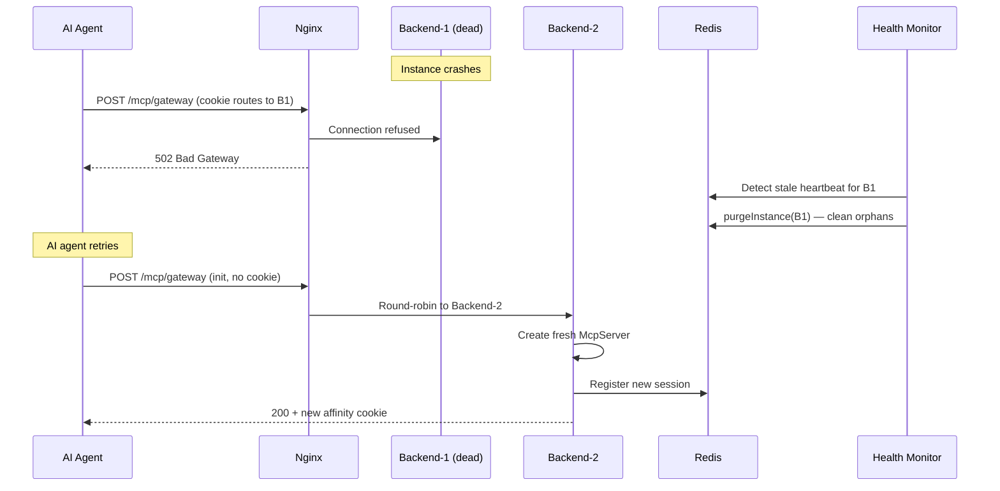
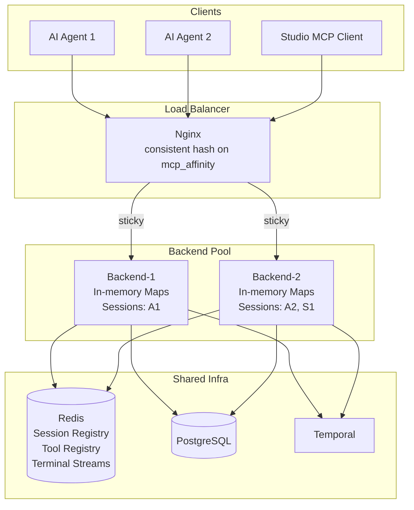
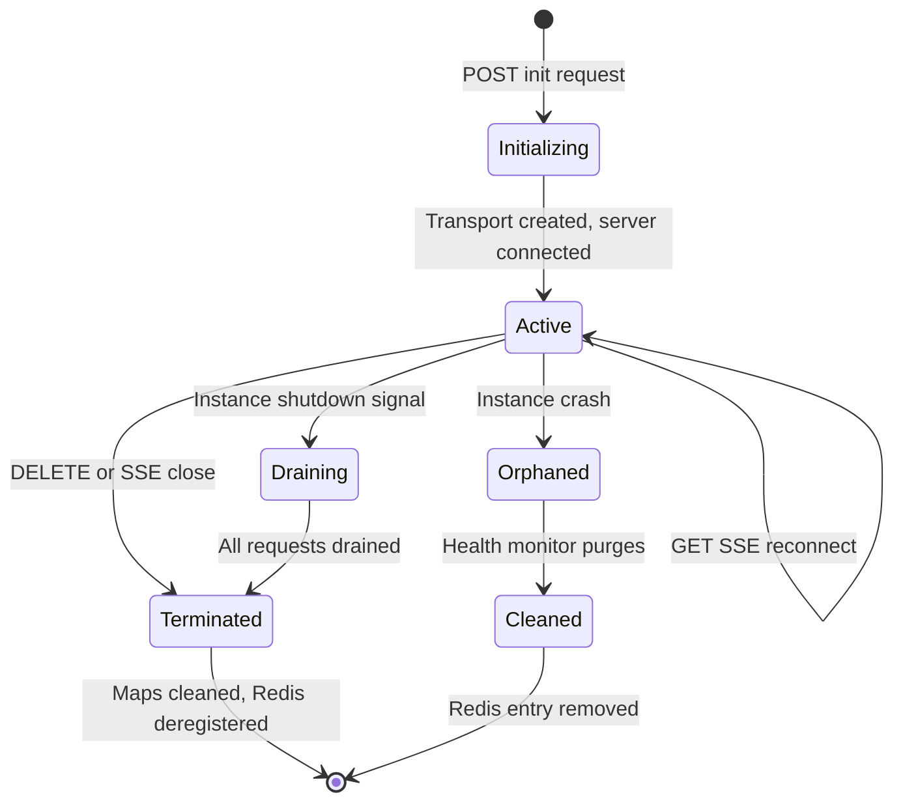

# ADR Part 3: Data Flow Diagrams

Continuation of the MCP State Externalization ADR.

---

## MCP Gateway Request Flow (with sticky sessions)

## Instance Failure Recovery Flow

## Component Topology (Production)

## Session Lifecycle State Machine

