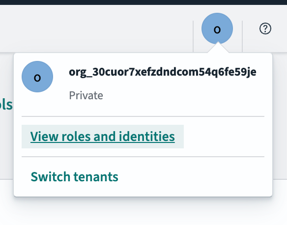
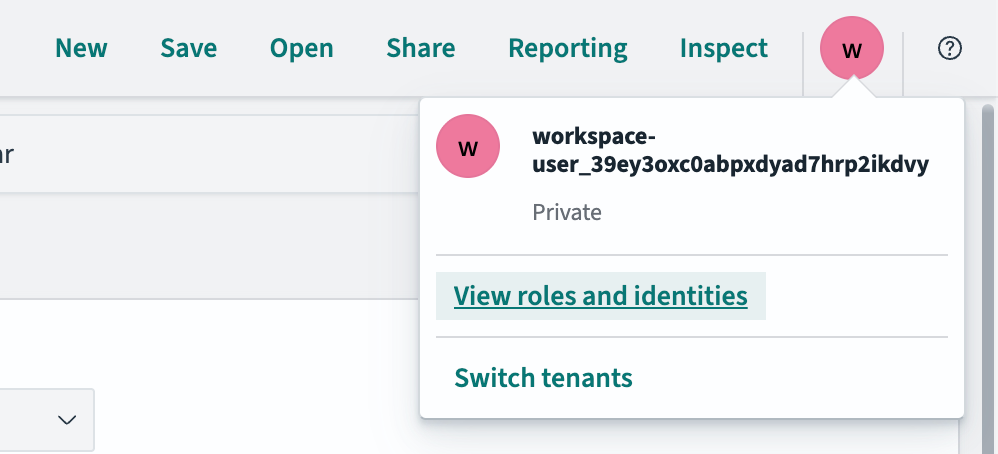
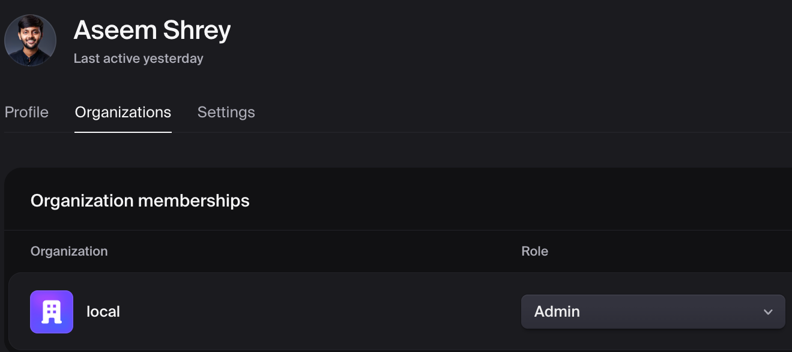
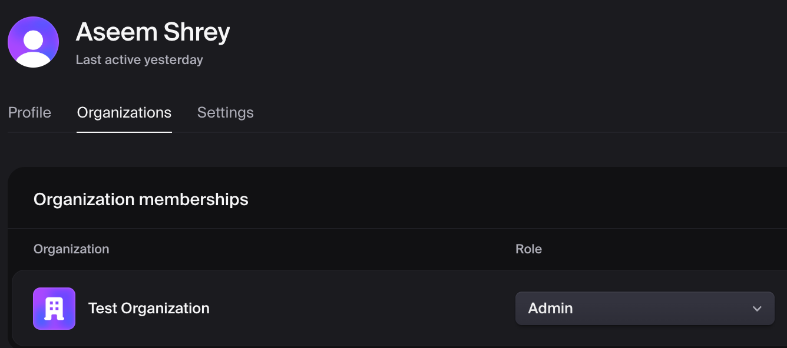

# Analytics Pipeline

This document describes the analytics infrastructure for Sentris Flow, including OpenSearch for data storage, OpenSearch Dashboards for visualization, and the routing architecture.

## Architecture Overview

```
┌─────────────────────────────────────────────────────────────────────┐
│                         Nginx (port 80)                              │
│                                                                      │
│  /analytics/*  ──────►  OpenSearch Dashboards (5601)                │
│  /api/*        ──────►  Backend API (3211)                          │
│  /*            ──────►  Frontend SPA (8080)                         │
└─────────────────────────────────────────────────────────────────────┘
                                    │
                                    ▼
┌─────────────────────────────────────────────────────────────────────┐
│                         Worker Service                               │
│                                                                      │
│  Analytics Sink Component  ──────►  OpenSearch (9200)               │
│  (OPENSEARCH_URL env var)                                           │
└─────────────────────────────────────────────────────────────────────┘
```

## Components

### OpenSearch (Port 9200)

Search and aggregation store for security findings and workflow analytics.

**Configuration:**

- Single-node deployment (dev/simple prod)
- Security plugin disabled for development
- Canonical observation index:
  `security-findings-o{sha256(exact-org-id)}-observations-v1`
- Tenant analytics namespace: `security-findings-o{sha256(exact-org-id)}-*`

Canonical observations use a stable index and deterministic document ID. This
keeps retries idempotent across UTC midnight and lets list/export pagination use
one point-in-time snapshot. A caller-selected custom suffix remains available
for non-finding analytics documents, except `observations-v1` and normalized
`YYYY.MM.DD` suffixes, which are reserved for canonical and legacy findings.
Canonical writes use create-only semantics: a retry that resolves to the same
document ID leaves the original observation content and timestamps intact,
including any newer triage projection.

### Upgrading daily findings indexes

Older releases wrote findings to daily `security-findings-{legacy-org-key}-YYYY.MM.DD`
indexes. Inspect the non-destructive migration plan for each organization:

```bash
OPENSEARCH_URL=http://localhost:9200 \
bun run migrate:findings-index -- --organization <organization-id>
```

After reviewing the source and target indexes, apply it:

```bash
OPENSEARCH_URL=http://localhost:9200 \
bun run migrate:findings-index -- --organization <organization-id> --apply
```

The command installs the content-addressed final ingest pipeline before the
exact organization template, applies the final pipeline and additive canonical
mappings to an existing stable index, and reindexes daily sources
oldest-to-newest into `observations-v1` with create-only writes. Each source
query requires the exact `sentris.organization_id`, so legacy names that
collapsed case cannot leak one organization into another. Documents without
that ownership field are not guessed; they require explicit operator review.

The command then scans the stable index in bounded pages, backfills indexed
contract classifications and normalized severity with optimistic concurrency,
refreshes those writes, verifies the installed pipeline, template, and mapping
again, and publishes a content- and index-UUID-bound integrity watermark.
Existing stable observations—and any newer projected triage—are never
overwritten. It rejects timed-out or failed reindex responses, classification
write failures, invariant drift, and incomplete scans, and never deletes source
indexes. Retain them until counts, schema coverage, and representative findings
have been verified, then remove exact, reviewed indexes through your normal
OpenSearch retention procedure.

### OpenSearch Dashboards (Port 5601)

Web UI for exploring and visualizing analytics data.

**Configuration (`opensearch-dashboards.yml`):**

```yaml
server.basePath: '/analytics'
server.rewriteBasePath: true
opensearch.hosts: ['http://opensearch:9200']
```

**Key Settings:**

- `basePath: "/analytics"` - All URLs are prefixed with `/analytics`
- `rewriteBasePath: true` - Strips `/analytics` from incoming requests, adds it back to responses

### Analytics Sink (Worker Component)

The `core.analytics.sink` component writes workflow results to OpenSearch.

**Input Ports:**

- Ships with a default `input1` port so at least one connector is always available.
- Users can configure additional input ports via the **Data Inputs** parameter
  (e.g., to aggregate results from multiple scanners into one index).
- Extra ports are resolved dynamically through the `resolvePorts` mechanism. When
  loading a saved workflow the backend calls `resolveGraphPorts()` server-side;
  when importing from a JSON file the frontend calls `resolvePorts` per-node to
  ensure all dynamic handles are present before rendering.

**Environment Variable:**

```yaml
OPENSEARCH_URL=http://opensearch:9200
```

**Document Structure:**

```json
{
  "contract": "sentris.finding-observation",
  "schema_version": 1,
  "finding_id": "fo_v1_0123456789abcdef0123456789abcdef0123456789abcdef0123456789abcdef",
  "observed_at": "2026-01-25T01:22:43.783Z",
  "@timestamp": "2026-01-25T01:22:43.783Z",
  "title": "Finding title",
  "severity": "high",
  "sentris_normalized_severity": "high",
  "description": "...",
  "evidence": null,
  "source": {
    "scanner": "nuclei"
  },
  "sentris": {
    "organization_id": "local-dev",
    "run_id": "sentris-run-xxx",
    "workflow_id": "workflow-xxx",
    "workflow_name": "My Workflow",
    "scope_id": null,
    "component_id": "core.analytics.sink",
    "node_ref": "analytics-sink-123",
    "asset_key": "https://example.test",
    "contract_validated": true,
    "contract_source_validated": true,
    "contract_document_id": "fo_v1_0123456789abcdef0123456789abcdef0123456789abcdef0123456789abcdef"
  }
}
```

The backend treats a document as canonical only when its versioned shared
schema, trusted-writer attestations, bound document ID, and full-query coverage
all agree. Legacy documents remain readable through the compatibility adapter;
invalid or incomplete coverage is surfaced as degraded rather than a successful
zero.

Canonical mappings are intentionally bounded. Known filter/search fields and
`sentris_normalized_severity` are indexed. Arbitrary scanner fields remain
unchanged in `_source`; `evidence` and `source` retain their JSON with indexing
disabled. Custom-suffix analytics indexes are generic and do not receive the
finding final pipeline or canonical mapping.

## Nginx Routing

All traffic flows through Nginx on port 80:

| Path           | Target                       | Description              |
| -------------- | ---------------------------- | ------------------------ |
| `/analytics/*` | `opensearch-dashboards:5601` | Analytics dashboard UI   |
| `/api/*`       | `backend:3211`               | Backend REST API         |
| `/*`           | `frontend:8080`              | Frontend SPA (catch-all) |

### OpenSearch Dashboards Routing Details

The `/analytics` route requires special handling:

1. **Authentication**: Routes are protected - users must be logged in to access
2. **Session Cookies**: Backend validates session cookies for analytics route auth
3. **BasePath Configuration**: OpenSearch Dashboards is configured with `server.basePath: "/analytics"`
4. **Proxy Pass**: Nginx forwards requests to OpenSearch Dashboards without path rewriting
5. **rewriteBasePath**: OpenSearch Dashboards strips `/analytics` internally and adds it back to URLs

```nginx
location /analytics/ {
    proxy_pass http://opensearch-dashboards;
    proxy_set_header osd-xsrf "true";
    proxy_cookie_path /analytics/ /analytics/;
}
```

## Frontend Integration

The frontend links to OpenSearch Dashboards Discover app with pre-filtered queries:

```typescript
const url = buildOpenSearchUrl({
  baseUrl: '/analytics',
  workflowId,
  runId,
  orgId: exactOrganizationId,
});

// Open in new tab
window.open(url, '_blank', 'noopener,noreferrer');
```

**Key points:**

- `sentris.run_id` and `sentris.workflow_id` are already mapped as `keyword`;
  do not add a `.keyword` suffix
- The helper hashes the exact organization ID and selects only its canonical
  observation index
- Use Discover app (`/app/discover`) for viewing raw data without saved views

**Environment Variable:**

```
VITE_OPENSEARCH_DASHBOARDS_URL=/analytics
```

## Data Flow

1. **Workflow Execution**: Worker runs workflow with Analytics Sink component
2. **Data Enrichment**: Analytics Sink adds `sentris.*` metadata fields
3. **Indexing**: Documents bulk-indexed to OpenSearch via `OPENSEARCH_URL`
4. **Visualization**: Users explore data in OpenSearch Dashboards at `/analytics`

## Analytics API Limits

To protect OpenSearch and keep queries responsive:

- `size` must be a non-negative integer and is capped at **1000**
- `from` must be a non-negative integer and is capped at **10000**

Requests exceeding these limits return `400 Bad Request`.

## Analytics Settings Updates

The analytics settings update API supports **partial updates**:

- `analyticsRetentionDays` is optional
- `subscriptionTier` is optional

Omit fields you don’t want to change. The backend validates the retention days only when provided.

## Multi-Tenant Architecture

When the OpenSearch Security plugin is enabled, each organization gets an isolated tenant with its own dashboards, index patterns, and saved objects.

### How Tenant Identity Is Resolved

The tenant identity for OpenSearch Dashboards is determined through a proxy auth flow:

1. **Browser navigation** to `/analytics/` sends the Clerk `__session` cookie
2. **nginx** sends an `auth_request` to the backend (`/api/v1/auth/validate`)
3. **Backend** decodes the JWT and resolves the exact organization identity:
   - If the JWT contains `org_id` (active Clerk organization session), that
     exact value owns the data
   - If the JWT has no `org_id`, it falls back to
     `workspace-{userId}` (personal workspace)
   - The backend sends Nginx the collision-safe
     `o{sha256(exact-organization-id)}` resource key
4. **nginx** forwards that key via `x-proxy-user`, `x-proxy-roles`, and
   `securitytenant` headers

### Important: Clerk Active Organization Session

The Clerk JWT `__session` cookie only contains `org_id` when the user has an **active organization session**. This is different from organization membership:

| Concept                   | Source                                        | Contains org info?                 |
| ------------------------- | --------------------------------------------- | ---------------------------------- |
| `organizationMemberships` | Clerk User object (frontend SDK)              | Lists ALL orgs the user belongs to |
| JWT `org_id`              | `__session` cookie (cryptographically signed) | Only the ACTIVE org, if any        |

If a user is a member of an organization but hasn't activated it (via Clerk's `OrganizationSwitcher` or `setActive()`), their JWT won't contain `org_id`, and they'll land in a personal workspace tenant instead of their organization's tenant.

### Tenant Provisioning

When a new `org_id` is seen during auth validation, the backend automatically provisions:

- An OpenSearch **tenant** named with the collision-safe organization key
- A **role** (`customer_o{sha256(exact-org-id)}_ro`) with read access to the
  matching `security-findings-o{sha256(exact-org-id)}-*` namespace and
  `kibana_all_write` tenant permissions
- A **role mapping** linking the role to the proxy auth backend role
- An exact observation **index template** and **seed index** with canonical
  mappings
- A default exact observation **index pattern** in the tenant's saved objects

### Security Guarantees

- The JWT is cryptographically signed by Clerk — `org_id` cannot be forged
- The backend validates `X-Organization-Id` headers against the JWT's `org_id` — cross-tenant header spoofing is rejected
- Case- and whitespace-distinct organization IDs produce different index,
  tenant, role, control-index, and Dashboards identities
- Each tenant has isolated roles, index patterns, and saved objects
- The `workspace-{userId}` fallback creates an isolated personal sandbox — no data leaks between tenants

## Troubleshooting

### OpenSearch Dashboards Opens an Empty Personal Workspace

**Symptom:** Dashboards opens an empty tenant after the user joined an
organization. Tenant resource names are opaque `o<sha256>` keys, so the visible
name alone does not identify whether the active identity is the organization or
the personal `workspace-{userId}` fallback.

**Expected (org tenant active):**



**Broken (workspace fallback):**



**Root Cause:** The user's Clerk session does not have an active organization.
The Clerk JWT (`__session` cookie) only includes `org_id` when the organization
is explicitly activated via `OrganizationSwitcher` or
`clerk.setActive({ organization: orgId })`. Without it, the backend hashes and
provisions the personal workspace identity instead.

This can happen when:

- The user signed up and was added to an org but never selected it in the UI
- The user's Clerk session expired and was recreated without org context
- The frontend didn't call `setActive()` after login

**Clerk Dashboard — user in "local" org (but no active session, causing fallback):**



**Clerk Dashboard — user in "Test Organization" (active session, working correctly):**



**Diagnosis:**

```bash
# Check backend logs for the auth resolution path
docker logs sentris-backend 2>&1 | grep -E "\[AUTH\].*Resolving org|No org found|Using org"

# Confirm whether auth selected an org or the personal workspace fallback.
# Do not infer the source identity by reversing the OpenSearch resource hash.
```

**Solution:**

1. Have the user switch to their organization using the Organization Switcher in the app UI
2. Ensure the frontend calls `clerk.setActive({ organization: orgId })` after login when the user belongs to an organization
3. After switching, refresh `/analytics/`; it should select the organization's
   hashed tenant and exact observation index

**Security Note:** This is a UX issue, not a security vulnerability. The
personal workspace fallback creates a separately hashed, isolated sandbox. See
the [Security Guarantees](#security-guarantees) section above.

### Accessing OpenSearch Dashboards as Admin (Maintenance)

For maintenance tasks (managing indices, debugging tenant provisioning, viewing all tenants, etc.), you need admin-level access to OpenSearch Dashboards.

**Why normal `/analytics/` access won't work as admin:**
The nginx `/analytics/` route always injects hashed organization-scoped proxy
headers (`x-proxy-user: o<sha256>` and the matching customer role). Since proxy
auth (order 0) takes priority over basic auth (order 1), OpenSearch ignores any
admin credentials and authenticates you as the organization-scoped user
instead.

**How to access as admin:**

Access Dashboards directly on port 5601, bypassing nginx entirely. Without proxy headers, the basic auth fallback activates.

**Development (via nginx routing):**

```
http://localhost/analytics
```

Log in with the admin credentials defined in `docker/opensearch-security/internal_users.yml` (default: `admin` / `admin`).

**Production (port not publicly exposed):**

Use SSH port forwarding to tunnel to the server's nginx port:

```bash
ssh -L 80:localhost:80 user@your-production-server
```

Then open `http://localhost/analytics` locally.

If the Dashboards container doesn't bind to the host network, find its Docker IP first:

```bash
# On the production server
docker inspect opensearch-dashboards | grep IPAddress

# Then tunnel to that IP
ssh -L 5601:<container-ip>:5601 user@your-production-server
```

**Admin capabilities:**

- View and manage all tenants
- Inspect index mappings and document counts
- Debug role mappings and security configuration
- Manage ISM policies and index lifecycle
- Access the Security plugin UI at `/app/security-dashboards-plugin`

### Analytics Sink Not Writing Data

**Symptom:** New workflow runs don't appear in OpenSearch

**Check:**

```bash
# Verify worker has OPENSEARCH_URL set
docker exec sentris-worker env | grep OPENSEARCH

# Check worker logs for indexing errors
docker logs sentris-worker 2>&1 | grep -i "analytics\|indexing"
```

**Solution:** Ensure `OPENSEARCH_URL=http://opensearch:9200` is set in worker environment.

### OpenSearch Dashboards Shows Blank Page

**Symptom:** Page loads but content area is empty

**Check:**

1. Browser console for JavaScript errors
2. Time range filter (data might be outside selected range)
3. Index pattern selection

**Solution:**

- Set time range to "Last 30 days" or wider
- Ensure the tenant-provisioned
  `security-findings-o<64-hex-digest>-observations-v1` index pattern is selected

### Query Returns No Results

**Check if data exists:**

```bash
# Use the exact index printed by the migration plan or provisioning logs.
OBSERVATION_INDEX="security-findings-o<64-hex-digest>-observations-v1"

# Count documents for one reviewed organization
curl -s "http://localhost:9200/${OBSERVATION_INDEX}/_count" | jq '.count'

# List run_ids with data
curl -s "http://localhost:9200/${OBSERVATION_INDEX}/_search" \
  -H "Content-Type: application/json" \
  -d '{"size":0,"aggs":{"run_ids":{"terms":{"field":"sentris.run_id"}}}}' \
  | jq '.aggregations.run_ids.buckets'
```

## Environment Variables

| Variable                         | Service  | Description                   |
| -------------------------------- | -------- | ----------------------------- |
| `OPENSEARCH_URL`                 | Worker   | OpenSearch connection URL     |
| `OPENSEARCH_USERNAME`            | Worker   | Optional: OpenSearch username |
| `OPENSEARCH_PASSWORD`            | Worker   | Optional: OpenSearch password |
| `VITE_OPENSEARCH_DASHBOARDS_URL` | Frontend | Dashboard URL for links       |

## See Also

- [Docker README](../docker/README.md) - Docker deployment configurations
- [nginx.prod.conf](../docker/nginx/nginx.prod.conf) - Container-mode nginx routing (full stack + production)
- [opensearch-dashboards.yml](../docker/opensearch-dashboards.yml) - Dashboard configuration
