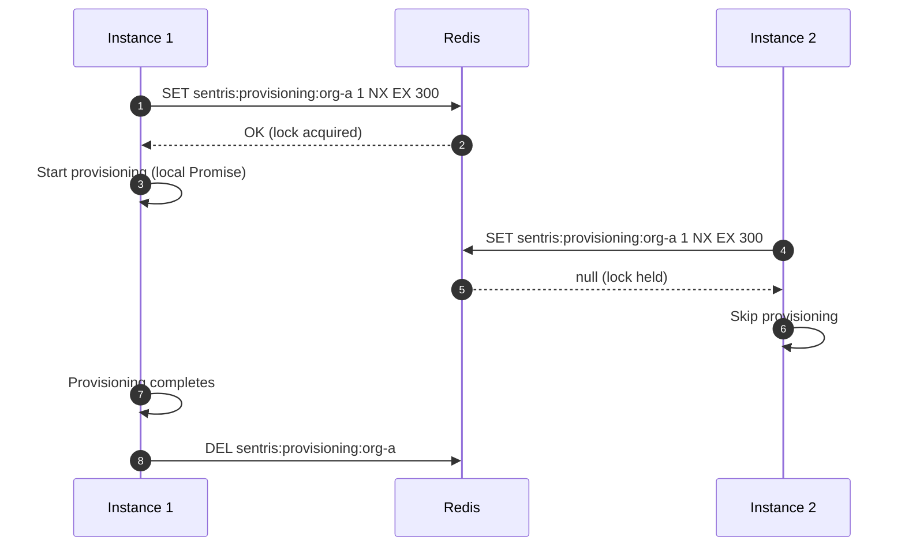
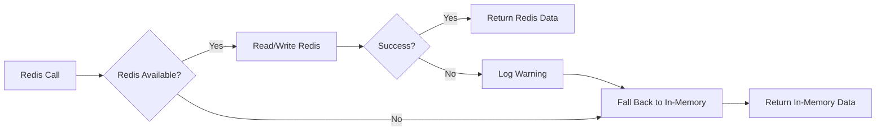
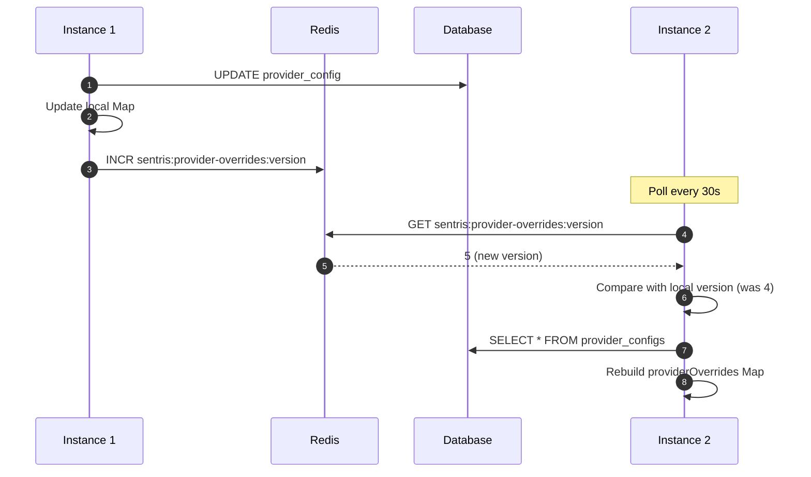

# ADR: Redis State Externalization

## Status

**Proposed** — 2026-03-04

## Problem Statement

Five backend services store ephemeral state in in-memory `Map` or `Set` structures. In a multi-instance deployment (PM2 or Kubernetes), each instance holds its own copy of this state, leading to:

1. **State loss on restart** — a backend restart drops all in-flight flow contexts, archiving locks, and provisioning dedup state.
2. **Instance affinity** — requests that depend on state (e.g., data-flow packet resolution) only succeed if routed to the instance that cached it.
3. **Stale cross-instance caches** — `providerOverrides` and `etagCache` diverge between instances with no invalidation mechanism.

The five services and their state:

| Service | Field | Type | Purpose |
| --------- | ------- | ------ | --------- |
| `WorkflowsService` | `flowContexts` | `Map<string, FlowContext>` | Compiled workflow graph cache for data-flow packet resolution |
| `TerminalArchiveService` | `archivingRuns` | `Set<string>` | Dedup guard preventing concurrent archive of the same run |
| `AppController` | `provisioningOrgs` | `Map<string, Promise<boolean>>` | Dedup lock for OpenSearch tenant provisioning |
| `GitHubSyncService` | `etagCache` | `Map<string, CachedResponse>` | HTTP ETag cache for conditional GitHub API requests |
| `IntegrationsService` | `providerOverrides` | `Map<string, ProviderCredentialOverride>` | DB-loaded OAuth credential overrides, cached in-memory |

## Constraints

- Redis is already deployed in infrastructure (`docker-compose.infra.yml`).
- Follow the `SessionRegistryService` / `ToolRegistryService` canonical pattern for injection and graceful degradation.
- All state is ephemeral cache or lock — no durable migration required.
- `FlowContext.targetsBySource` is a `Map<string, Array<{targetRef, sourceHandle, inputKey}>>` requiring explicit serialization.
- `provisioningOrgs` stores `Promise<boolean>` — only the lock flag is externalizable; in-flight Promise tracking remains local.
- Graceful degradation is mandatory: Redis unavailability must never crash a request.

## Options Considered

### Option A: Shared Single Redis Connection

All five services share a single `ioredis` connection via one injection token (`STATE_REDIS`). Key namespaces prevent collision.

**Pros:**

- Simplest configuration — one URL, one provider factory, one connection.
- Fewer open connections to Redis.
- Matches the spirit of `MCP_DISCOVERY_REDIS` (shared by discovery + sessions).

**Cons:**

- A slow `KEYS` or `HGETALL` in one service can block others on the same connection.
- Single point of failure for connection- or auth-level errors.
- Cannot tune per-service Redis settings (DB index, timeout).

### Option B: Per-Domain Redis Tokens (Recommended)

Each logical domain gets its own injection token and connection instance, but all share the same Redis URL (configurable override per token if needed). This follows the existing pattern where `TOOL_REGISTRY_REDIS`, `SESSION_REGISTRY_REDIS`, and `MCP_DISCOVERY_REDIS` each get independent connections.

**Pros:**

- Fault isolation — one service's Redis error does not block others.
- Independent `onModuleDestroy` lifecycle per connection.
- Matches existing codebase conventions exactly.
- Each token can be independently set to `null` to disable.

**Cons:**

- More open connections (6-7 total including existing ones). Acceptable for Redis.
- Slightly more boilerplate in provider factories.

### Recommendation

**Option B — Per-Domain Redis Tokens.** It matches the established pattern (`mcp.module.ts` already creates 3 independent connections), provides fault isolation, and allows incremental rollout per service.

## Key Namespace Convention

All new keys use the namespace `sentris:{domain}:{identifier}`. Existing MCP keys (`mcp:*`) are unchanged.

### Key Patterns

| Key Pattern | Redis Type | Service | Description |
| ------------- | ----------- | --------- | ------------- |
| `sentris:flow-context:{runId}` | String (JSON) | `FlowContextCacheService` | Serialized `FlowContext` for a workflow run |
| `sentris:archiving:{runId}` | String (instanceId) | `ArchivingLockService` | Lock with instanceId value for compare-and-delete |
| `sentris:provisioning:lock:{orgId}` | String (instanceId) | `ProvisioningLockService` | Lock with instanceId value for compare-and-delete |
| `sentris:provisioning:done:{orgId}` | String (`"1"`) | `ProvisioningLockService` | Completion marker indicating provisioning succeeded |
| `sentris:etag-cache:{sha256(url)}` | String (JSON) | `EtagCacheService` | Cached ETag + response body for a GitHub API URL |
| `sentris:provider-overrides:version` | String (integer) | `IntegrationsService` | Monotonic version counter for cache invalidation |
| `sentris:instances:{instanceId}` | String (JSON) | `InstanceHeartbeatService` | Instance liveness heartbeat |

### Key Pattern Notes

- `{runId}` — Temporal workflow run ID (UUID format).
- `{orgId}` — Lowercase-normalized organization ID.
- `{urlHash}` — SHA-256 hex of the full GitHub API URL (avoids special characters in keys).
- `{instanceId}` — `buildInstanceId()` = `${HOSTNAME || os.hostname()}-${SENTRIS_INSTANCE ?? pm_id ?? pid}` (unique per process in multi-instance deployments).

## TTL Policy

| Key Pattern | TTL | Rationale |
| ------------- | ----- | ----------- |
| `sentris:flow-context:{runId}` | 600s (10 min) | Matches existing `FLOW_CONTEXT_TTL_MS = 10 * 60 * 1000`. Set on write, not refreshed. |
| `sentris:archiving:{runId}` | 900s (15 min) | Safety bound — archive operations take seconds; prevents permanent lock on crash. |
| `sentris:provisioning:{orgId}` | 300s (5 min) | Tenant provisioning completes in <10s; prevents stale lock on crash. |
| `sentris:etag:{urlHash}` | 2100s (35 min) | Exceeds 30-minute sync interval so cached ETags survive between sync cycles. |
| `sentris:provider-overrides:version` | None (persistent) | Monotonic counter; must survive restarts to detect stale caches. |
| `sentris:instances:{instanceId}` | 30s | Short TTL; instances refresh every 10s. Missing key = dead peer. |

## Serialization Schemas

### FlowContext Serialization

`FlowContext` contains a `targetsBySource` field of type `Map<string, Array<{targetRef, sourceHandle, inputKey}>>`. JavaScript `Map` does not serialize to JSON natively.

**Serialize (write):**

```typescript
interface SerializedFlowContext {
  workflowId: string;
  workflowVersionId: string;
  workflowVersion: number;
  // definition is NOT stored — large and only targetsBySource is needed
  targetsBySource: Record<string, { targetRef: string; sourceHandle: string; inputKey: string }[]>;
}

function serializeFlowContext(ctx: FlowContext): string {
  const serialized: SerializedFlowContext = {
    workflowId: ctx.workflowId,
    workflowVersionId: ctx.workflowVersionId,
    workflowVersion: ctx.workflowVersion,
    targetsBySource: Object.fromEntries(ctx.targetsBySource),
  };
  return JSON.stringify(serialized);
}
```

**Deserialize (read):**

```typescript
function deserializeFlowContext(json: string): Omit<FlowContext, 'definition'> & {
  targetsBySource: FlowContext['targetsBySource'];
} {
  const parsed = JSON.parse(json) as SerializedFlowContext;
  return {
    ...parsed,
    targetsBySource: new Map(Object.entries(parsed.targetsBySource)),
  };
}
```

**Key decisions:**

- `definition` (the full `WorkflowDefinition`) is omitted from Redis. It is large and only `targetsBySource` is needed for `buildDataFlowPackets`. If the full definition is needed, it is re-fetched from the database.
- `Object.fromEntries()` / `Object.entries()` round-trips the `Map` through a plain object.

### ETag Cache Serialization

```typescript
interface SerializedCachedResponse {
  etag: string;
  data: unknown; // GitHubFile[] or string content
}
```

Direct `JSON.stringify` / `JSON.parse` — no special handling needed.

### Instance Heartbeat Serialization

```typescript
interface InstanceHeartbeat {
  hostname: string;
  pid: number;
  startedAt: string;     // ISO 8601
  lastHeartbeat: string;  // ISO 8601
  version?: string;       // app version for observability
}
```

## Distributed Lock Design — provisioningOrgs

The `provisioningOrgs` pattern is a dedup lock: if org X is already being provisioned, skip it. The local `Promise<boolean>` cannot be serialized. The design uses a two-layer approach.

### Lock Flow



### Implementation Pattern

```typescript
// In AppController.validateAuth()
if (normalizedOrgId && !this.provisioningOrgs.has(normalizedOrgId)) {
  const lockKey = `sentris:provisioning:${normalizedOrgId}`;
  let acquiredLock = false;

  if (this.redis) {
    try {
      const result = await this.redis.set(lockKey, '1', 'EX', 300, 'NX');
      acquiredLock = result === 'OK';
    } catch {
      acquiredLock = true; // Redis down — fall through to local dedup
    }
  } else {
    acquiredLock = true; // No Redis — use local Map only
  }

  if (acquiredLock) {
    const promise = this.tenantService.ensureTenantExists(normalizedOrgId).then(
      (success) => {
        this.provisioningOrgs.delete(normalizedOrgId);
        this.redis?.del(lockKey).catch(() => {});
        return success;
      },
      (err) => {
        this.provisioningOrgs.delete(normalizedOrgId);
        this.redis?.del(lockKey).catch(() => {});
        this.logger.error(`Failed to provision: ${err}`);
        return false;
      },
    );
    this.provisioningOrgs.set(normalizedOrgId, promise);
  }
}
```

**Why not Redlock?** The `provisioningOrgs` lock protects an idempotent operation (tenant provisioning). Double-execution is harmless — the tenant service is itself idempotent. Simple `SETNX` + TTL is sufficient; Redlock adds complexity without benefit.

## Graceful Degradation Rules

All Redis-backed state follows the `SessionRegistryService` pattern: Redis is optional, and failures are logged but never thrown.

### Rules

| Rule | Description |
| ------ | ------------- |
| **Null guard** | If `this.redis` is `null` (not configured), skip Redis operations and fall through to in-memory. |
| **Try/catch every call** | Every Redis call is wrapped in try/catch. On error, log a warning and fall through. |
| **Never throw from Redis path** | Redis failures must never propagate to the caller. The in-memory path is always the fallback. |
| **Log at warn level** | Use `this.logger.warn()` for Redis failures — visible but not alerting. |
| **Dual-write during migration** | Services write to both in-memory and Redis. Reads try Redis first, fall back to in-memory. |

### Degradation by Service

| Service | Redis Down Behavior |
| --------- | ------------------- |
| `WorkflowsService` (flowContexts) | Falls back to local `Map`. Instance affinity required but data-flow packets still work on the originating instance. |
| `TerminalArchiveService` (archivingRuns) | Falls back to local `Set`. Concurrent archive across instances is possible but idempotent. |
| `AppController` (provisioningOrgs) | Falls back to local `Map<Promise>`. Cross-instance dedup lost but tenant provisioning is idempotent. |
| `GitHubSyncService` (etagCache) | Falls back to local `Map`. Each instance maintains its own ETag cache — more GitHub API calls, no correctness impact. |
| `IntegrationsService` (providerOverrides) | Falls back to startup-loaded cache. Cache invalidation across instances stops, but DB reload on next restart corrects it. |

### Degradation Flow



## Connection Sharing Strategy

Following Option B, each domain gets its own injection token. All tokens resolve from the same `REDIS_URL` environment variable but create independent `ioredis` instances.

### Injection Tokens

| Token | Module | Services |
| ------- | -------- | ---------- |
| `FLOW_CONTEXT_REDIS` | `WorkflowsModule` | `FlowContextCacheService` |
| `ARCHIVING_REDIS` | `WorkflowsModule` | `ArchivingLockService` |
| `PROVISIONING_REDIS` | `AppModule` | `ProvisioningLockService` |
| `TEMPLATE_CACHE_REDIS` | `TemplatesModule` | `EtagCacheService` |
| `INTEGRATION_CACHE_REDIS` | `IntegrationsModule` | `IntegrationsService` |
| `INSTANCE_HEARTBEAT_REDIS` | `InstanceHeartbeatModule` | `InstanceHeartbeatService` |

### Provider Factory Pattern

Each module registers its provider following the `mcp.module.ts` pattern:

```typescript
{
  provide: FLOW_CONTEXT_REDIS,
  useFactory: (configService: ConfigService) => {
    const redis = configService.get<RedisConfig>('redis')!;
    const url = redis.url ?? redis.terminalUrl;
    if (!url) {
      new Logger('WorkflowsModule').warn('Redis URL not set; workflow state cache disabled');
      return null;
    }
    const client = new Redis(url);
    client.on('error', (err) => new Logger('WorkflowsModule').warn(`FLOW_CONTEXT_REDIS error: ${err.message}`));
    return client;
  },
  inject: [ConfigService],
}
```

### Redis Config Extension

Add a `stateUrl` field to `RedisConfig` for optional separation:

```typescript
export interface RedisConfig {
  url: string | undefined;
  terminalUrl: string | undefined;
  toolRegistryUrl: string | undefined;
}
```

New tokens resolve `url ?? terminalUrl` in that order.

## Cache Invalidation — providerOverrides

`providerOverrides` is a DB-loaded cache that changes infrequently (admin action). When Instance A updates an override, Instance B's cache is stale.

### Strategy: Version Counter + Polling

A monotonic version counter in Redis (`sentris:provider-overrides:version`) is incremented on every mutation. Each instance polls every 30s and reloads from DB if the version has changed.

**Why not pub/sub?** Pub/sub requires a persistent subscriber connection and messages are lost if an instance is temporarily disconnected. Version-counter polling is simpler, stateless, and self-healing.

### Invalidation Flow



### Implementation Sketch

```typescript
private cachedVersion = 0;
private versionCheckInterval: NodeJS.Timeout;

async onModuleInit(): Promise<void> {
  await this.reloadProviderOverrides();
  this.versionCheckInterval = setInterval(() => this.checkVersionAndReload(), 30_000);
}

private async checkVersionAndReload(): Promise<void> {
  if (!this.redis) return;
  try {
    const version = Number(await this.redis.get('sentris:provider-overrides:version')) || 0;
    if (version > this.cachedVersion) {
      await this.reloadProviderOverrides();
      this.cachedVersion = version;
    }
  } catch (err) {
    this.logger.warn(`Failed to check provider-overrides version: ${err}`);
  }
}
```

## Instance Heartbeat Design

Each backend instance publishes a heartbeat to Redis. Other instances and monitoring tools use this to detect dead peers.

### Key Pattern

`sentris:instances:{instanceId}` — String (JSON) with 30s TTL, refreshed every 10s.

### Lifecycle

1. **Startup** — write heartbeat with `SET ... EX 30`.
2. **Every 10s** — refresh: `SET ... EX 30` (overwrites with updated `lastHeartbeat`).
3. **Shutdown** — `DEL sentris:instances:{instanceId}` in `onModuleDestroy`.
4. **Crash** — key expires in 30s; no manual cleanup needed.

### Dead Peer Detection

To list live instances: `KEYS sentris:instances:*` (admin-only, low cardinality). A missing key means the instance has been down for >30s. Cross-reference with `SessionRegistryService.listActiveSessions()` for richer observability.

### Implementation

```typescript
@Injectable()
export class InstanceHeartbeatService implements OnModuleInit, OnModuleDestroy {
  private readonly instanceId = process.env.HOSTNAME || hostname();
  private readonly startedAt = new Date().toISOString();
  private heartbeatInterval: NodeJS.Timeout;

  constructor(@Inject(INSTANCE_HEARTBEAT_REDIS) private readonly redis: Redis | null) {}

  async onModuleInit(): Promise<void> {
    await this.publishHeartbeat();
    this.heartbeatInterval = setInterval(() => this.publishHeartbeat(), 10_000);
  }

  async onModuleDestroy(): Promise<void> {
    clearInterval(this.heartbeatInterval);
    try { await this.redis?.del(`sentris:instances:${this.instanceId}`); } catch { /* */ }
  }

  private async publishHeartbeat(): Promise<void> {
    if (!this.redis) return;
    try {
      await this.redis.set(
        `sentris:instances:${this.instanceId}`,
        JSON.stringify({
          hostname: this.instanceId,
          pid: process.pid,
          startedAt: this.startedAt,
          lastHeartbeat: new Date().toISOString(),
        }),
        'EX', 30,
      );
    } catch { /* non-fatal */ }
  }
}
```

## Migration Path

All five services store ephemeral cache or lock state — no durable data migration is needed.

### Phase 1: Dual-Write (Initial Deployment)

1. Add Redis injection tokens and provider factories to each module.
2. Services write to **both** in-memory and Redis.
3. Reads check Redis first; on miss or error, fall back to in-memory.
4. Monitor Redis error rates and latency.

### Phase 2: Redis-Primary (After Validation)

1. Once Redis stability is confirmed (1-2 weeks), reads go to Redis only.
2. In-memory structures kept as hot fallback but not read under normal operation.

### Phase 3: Cleanup (Optional)

1. Remove in-memory `Map`/`Set` declarations if Redis has proven fully reliable.
2. This phase is optional — keeping in-memory as fallback has negligible cost.

### Rollback

Remove the Redis injection (`@Inject` becomes `null`). The null guard disables Redis immediately.


## Risks and Mitigations

| Risk | Severity | Mitigation |
| ------ | ---------- | ------------ |
| Redis outage causes data loss | Low | All state is ephemeral cache; services degrade to in-memory. |
| Serialization bugs corrupt FlowContext | Medium | Unit test serialize/deserialize round-trip. Compare against DB-reconstructed context. |
| Key collision between services | Low | Namespace convention enforced by code review. No overlapping patterns. |
| Connection exhaustion | Low | ~10 total connections. Redis handles 10,000+. |
| `providerOverrides` polling adds DB load | Low | One SELECT per instance per 30s, only when version changes. |
| Heartbeat key proliferation from restarts | Low | 30s TTL auto-cleans orphaned keys. |

## Summary of Key Decisions

1. **Per-domain injection tokens** (Option B) — matches existing `mcp.module.ts` pattern.
2. **Namespace: `sentris:{domain}:{identifier}`** — collision-free, grep-friendly.
3. **`FlowContext` serialization omits `definition`** — only `targetsBySource` needed; reduces payload 10x.
4. **Simple `SETNX` + TTL for `provisioningOrgs`** — Redlock unnecessary for idempotent operations.
5. **Version-counter polling for `providerOverrides`** — simpler and more reliable than pub/sub.
6. **Heartbeat: 30s TTL, 10s refresh** — 3x safety margin; crash detection within 30s.
7. **Dual-write migration** — zero risk, instant rollback by setting injection to `null`.
8. **Graceful degradation is mandatory** — every Redis call is non-fatal, guarded by null check + try/catch.
