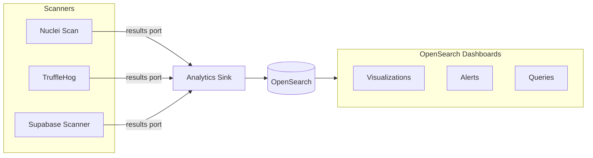

Sentris Flow includes a workflow analytics system that indexes security findings into OpenSearch. This enables real-time dashboards, historical trend analysis, and alerting on security data.

---

## Overview

The analytics system consists of:

1. **Analytics Sink component** - Indexes workflow output data into OpenSearch
2. **Results output port** - Structured findings from security scanners
3. **OpenSearch storage** - Stable observation indexes for querying and visualization
4. **View Analytics button** - Quick access to filtered dashboards

---

## Architecture



Each scanner outputs findings through its `results` port, which connects to the Analytics Sink. The sink indexes each finding as a separate document with workflow metadata.

---

## Document Structure

Indexed documents follow this structure:

```json
{
  "check_id": "DB_RLS_DISABLED",
  "severity": "critical",
  "sentris_normalized_severity": "critical",
  "title": "RLS Disabled on Table: users",
  "resource": "public.users",
  "metadata": {
    "schema": "public",
    "table": "users"
  },
  "scanner": "supabase-scanner",
  "asset_key": "abcdefghij1234567890",
  "finding_hash": "a1b2c3d4e5f67890",
  "contract": "sentris.finding-observation",
  "schema_version": 1,
  "finding_id": "fo_v1_0123456789abcdef0123456789abcdef0123456789abcdef0123456789abcdef",
  "observed_at": "2026-01-21T10:30:00.000Z",
  "description": "Row-level security is disabled.",
  "evidence": null,
  "source": {
    "scanner": "supabase-scanner",
    "finding_hash": "a1b2c3d4e5f67890"
  },
  "sentris": {
    "organization_id": "org_123",
    "run_id": "sentris-run-xxx",
    "workflow_id": "d1d33161-929f-4af4-9a64-xxx",
    "workflow_name": "Supabase Security Audit",
    "scope_id": null,
    "component_id": "core.analytics.sink",
    "node_ref": "analytics-sink-1",
    "asset_key": "abcdefghij1234567890",
    "contract_validated": true,
    "contract_source_validated": true,
    "contract_document_id": "fo_v1_0123456789abcdef0123456789abcdef0123456789abcdef0123456789abcdef"
  },
  "@timestamp": "2026-01-21T10:30:00.000Z"
}
```

### Field Categories

| Category         | Fields                                   | Description                                      |
| ---------------- | ---------------------------------------- | ------------------------------------------------ |
| Finding data     | `severity`, `title`, `description`, etc. | Canonical searchable fields plus raw source data |
| Normalized data  | `sentris_normalized_severity`            | Indexed lower-case severity used by reads        |
| Asset tracking   | `scanner`, `asset_key`, `finding_hash`   | Indexed fields for analytics                     |
| Workflow context | `sentris.*`                              | Trusted metadata from workflow execution         |
| Timestamp        | `@timestamp`                             | Observation timestamp                            |

<Note>
  Canonical observation mappings use `dynamic: false`. Arbitrary scanner fields remain unchanged in
  `_source` for API/detail display but do not create mappings. `evidence` and `source` are also
  retained as JSON with indexing disabled, so nested payloads do not create mapping conflicts or
  field explosion. Query fields must be part of the canonical mapping.
</Note>

---

## `sentris` context fields

The Analytics Sink automatically adds workflow context under the `sentris` namespace:

| Field                       | Description                                                |
| --------------------------- | ---------------------------------------------------------- |
| `organization_id`           | Organization that owns the workflow                        |
| `run_id`                    | Unique identifier for this workflow execution              |
| `workflow_id`               | ID of the workflow definition                              |
| `workflow_name`             | Human-readable workflow name                               |
| `component_id`              | Component type (always `core.analytics.sink`)              |
| `node_ref`                  | Node reference in the workflow graph                       |
| `asset_key`                 | Auto-detected or specified asset identifier                |
| `contract_validated`        | Shared contract validation completed by the trusted writer |
| `contract_source_validated` | Identity came from authorized execution context            |
| `contract_document_id`      | Canonical ID bound to the OpenSearch document ID           |

---

## Finding Hash for Deduplication

The `finding_hash` is a stable 16-character identifier that enables tracking findings across workflow runs.

### Purpose

- **New vs recurring**: Determine if a finding appeared before
- **First-seen / last-seen**: Track when findings were first and last detected
- **Resolution tracking**: Findings that stop appearing may be resolved
- **Deduplication**: Remove duplicates in dashboards across runs

### Generation

Each scanner generates the hash from key identifying fields:

| Scanner          | Hash Fields                          |
| ---------------- | ------------------------------------ |
| Nuclei           | `templateId + host + matchedAt`      |
| TruffleHog       | `DetectorType + Redacted + filePath` |
| Supabase Scanner | `check_id + projectRef + resource`   |

Fields are normalized (lowercase, trimmed) and hashed with SHA-256, truncated to 16 hex characters.

---

## Querying Data

### Basic Queries (KQL)

```
# Find all findings for an asset
asset_key: "api.example.com"

# Filter by severity
sentris_normalized_severity: "critical" OR sentris_normalized_severity: "high"

# Filter by scanner
scanner: "nuclei"

# All findings from a specific workflow run
sentris.run_id: "sentris-run-abc123"

# Filter by organization
sentris.organization_id: "org_123"

# Filter by workflow
sentris.workflow_id: "d1d33161-929f-4af4-9a64-xxx"
```

### Tracking Findings Over Time

```
# Track a specific finding across runs
finding_hash: "a1b2c3d4e5f67890"

# Find recurring findings (multiple runs)
# Use aggregation: group by finding_hash, count occurrences
```

### Common Aggregations

| Aggregation                              | Use Case                   |
| ---------------------------------------- | -------------------------- |
| `terms` on `sentris_normalized_severity` | Count findings by severity |
| `terms` on `scanner`                     | Count findings by scanner  |
| `terms` on `asset_key`                   | Most vulnerable assets     |
| `date_histogram` on `@timestamp`         | Findings over time         |
| `cardinality` on `finding_hash`          | Unique findings count      |

---

## Setting Up OpenSearch

### Environment Variables

Set these in your `worker/.env`:

```bash
OPENSEARCH_URL=http://localhost:9200
OPENSEARCH_USERNAME=admin
OPENSEARCH_PASSWORD=admin
```

Set this in your `frontend/.env`:

```bash
VITE_OPENSEARCH_DASHBOARDS_URL=http://localhost/analytics
```

### Docker Compose

The infrastructure stack includes OpenSearch and OpenSearch Dashboards:

```bash
docker compose -f docker/docker-compose.infra.yml up -d opensearch opensearch-dashboards
```

### Index Pattern

On first use, the worker asks the backend to install the content-addressed
findings ingest pipeline, the exact per-organization observation template, and
the stable observation index, then reads them back and hash-verifies the
pipeline, template, index setting, and mapping. This data-plane provisioning
runs in both security-disabled trusted-local mode and secured deployments. A
verification mismatch is reported as degraded instead of being cached as a
successful first use. The global `security-findings-o*-observations-v1`
template remains a bootstrap fallback while that idempotent request completes.

When OpenSearch Security is enabled, tenant provisioning creates the
organization's exact observation index pattern automatically. For a
security-disabled local environment, an administrator can create a development
pattern:

1. Go to **Dashboards Management** > **Index Patterns**
2. Create pattern: `security-findings-o*-observations-v1`
3. Select `@timestamp` as the time field
4. Click **Create index pattern**

The development wildcard spans every organization and is not a tenant boundary.
Do not expose a security-disabled Dashboards instance to untrusted users.

<Warning>
  If you don't see `sentris.*` fields in Available Fields after indexing, refresh the index pattern
  field list in Dashboards Management.
</Warning>

---

## Analytics API Limits

The analytics query API enforces sane bounds to protect OpenSearch:

- `size` must be a non-negative integer and is capped at **1000**
- `from` must be a non-negative integer and is capped at **10000**

Requests above these limits return `400 Bad Request`.

## Analytics Settings Updates

The analytics settings API supports partial updates:

- `analyticsRetentionDays` is optional
- `subscriptionTier` is optional

Omit fields you don’t want to change. The backend validates retention days only when provided.

---

## Using Analytics Sink

### Basic Workflow

1. Add a security scanner to your workflow (Nuclei, TruffleHog, etc.)
2. Add an Analytics Sink component
3. Connect the scanner's `results` port to the Analytics Sink's `data` input
4. Run the workflow

### Component Parameters

| Parameter             | Description                                                                                                                            |
| --------------------- | -------------------------------------------------------------------------------------------------------------------------------------- |
| **Index Suffix**      | Optional custom suffix for non-finding analytics. Leave empty for canonical findings; canonical and legacy date suffixes are reserved. |
| **Asset Key Field**   | Field to use as asset identifier. Auto-detect checks: asset_key > host > domain > subdomain > url > ip > asset > target                |
| **Custom Field Name** | Custom field when Asset Key Field is "custom"                                                                                          |
| **Fail on Error**     | When enabled, workflow stops if indexing fails. Default: fire-and-forget.                                                              |

### Fire-and-Forget Mode

By default, Analytics Sink operates in fire-and-forget mode:

- Indexing errors are logged but don't stop the workflow
- Useful for non-critical analytics that shouldn't block security scans
- Enable "Fail on Error" for strict indexing requirements

---

## View Analytics Button

The workflow builder includes a "View Analytics" button that opens OpenSearch Dashboards with pre-filtered data:

- **When a run is selected**: Filters by `sentris.run_id`
- **When no run is selected**: Filters by `sentris.workflow_id`
- **Time range**: Last 7 days

The button only appears when `VITE_OPENSEARCH_DASHBOARDS_URL` is configured.

---

## Index Naming

Canonical finding observations use:
`security-findings-o{sha256(exactOrgId)}-observations-v1`.

| Component               | Value                                                              |
| ----------------------- | ------------------------------------------------------------------ |
| `o{sha256(exactOrgId)}` | SHA-256 of the exact UTF-8 organization ID, including case/spacing |
| `observations-v1`       | Stable, versioned observation index suffix                         |

Example for `org_abc123`:
`security-findings-od12423efcee5b1b72255baf2fc2e5a226bdd9db9be3eb4155d8e9ee74006c863-observations-v1`.

The stable name and deterministic document ID make retries idempotent across
UTC midnight. Explicit custom suffixes remain available for non-finding
analytics use cases, except `observations-v1` and normalized `YYYY.MM.DD`
suffixes. Canonical writes are create-only: replay preserves the original
observation content and timestamps as well as any newer projected triage.
Custom analytics indexes use the same hashed organization namespace but do not
inherit the finding pipeline or canonical mapping. Legacy daily findings indexes
are upgraded non-destructively with `bun run migrate:findings-index`.

---

## Building Dashboards

### Recommended Visualizations

| Visualization             | Description                                             |
| ------------------------- | ------------------------------------------------------- |
| **Findings Over Time**    | Line chart with `@timestamp` on X-axis, count on Y-axis |
| **Severity Distribution** | Pie chart with `terms` on `sentris_normalized_severity` |
| **Top Vulnerable Assets** | Bar chart with `terms` on `asset_key`                   |
| **Findings by Scanner**   | Bar chart with `terms` on `scanner`                     |
| **New vs Recurring**      | Use `finding_hash` cardinality vs total count           |

### Alert Examples

| Alert                     | Query                                     |
| ------------------------- | ----------------------------------------- |
| Critical finding detected | `sentris_normalized_severity: "critical"` |
| New secrets exposed       | `scanner: "trufflehog"`                   |
| RLS disabled              | `check_id: "DB_RLS_DISABLED"`             |

---

## Troubleshooting

### Data not appearing in OpenSearch

1. Check worker logs for `[OpenSearchIndexer]` messages
2. Verify `OPENSEARCH_URL` is set in worker environment
3. Ensure Analytics Sink is connected to a `results` port
4. Check if OpenSearch is running: `curl http://localhost:9200/_cluster/health`

### Field mapping errors

If you see "Limit of total fields [1000] has been exceeded":

1. Identify the exact affected index with
   `curl -s "http://localhost:9200/_cat/indices/security-findings-*?h=index,docs.count,store.size"`.
2. If it is a legacy finding index, inspect and run
   `bun run migrate:findings-index -- --organization <exact-organization-id>`.
3. If it is a custom analytics index, define a controlled mapping or use a new
   explicit suffix before re-running the workflow.

The findings migration uses exact `sentris.organization_id` ownership,
create-only reindexing, and never deletes source indexes. Never use a broad
`security-findings-*` delete while recovering one tenant.

### sentris fields not visible

1. Fields starting with `_` are hidden in OpenSearch UI
2. Ensure you're using `sentris.*` (no underscore prefix)
3. Refresh the index pattern in Dashboards Management

### pm2 not loading environment variables

pm2's `env_file` doesn't auto-inject variables. The worker uses a custom `loadWorkerEnv()` function in `pm2.config.cjs`. After changing `worker/.env`:

```bash
pm2 delete sentris-worker
pm2 start pm2.config.cjs --only sentris-worker
```

---

## Best Practices

### Do

- Connect `results` ports (not `rawOutput`) to Analytics Sink
- Leave the index suffix empty for security findings; use meaningful custom
  suffixes only for generic analytics data
- Monitor index size and implement retention policies
- Create saved searches for common queries

### Don't

- Don't expect arbitrary `_source`, `evidence`, or `source` JSON fields to be searchable
- Don't rely on analytics for critical workflow logic
- Don't store PII or secrets in indexed findings

---

## Component Author Guidelines

If you're building a security scanner component, see [Analytics Output Port](/development/component-development#analytics-output-port-results) for implementation details on adding the `results` output port.

---

## Related

- [Component Development](/development/component-development) - Building scanner components
- [Core Components](/components/core) - Analytics Sink reference
- [Analytics (PostHog)](/development/analytics) - Product analytics (different system)
