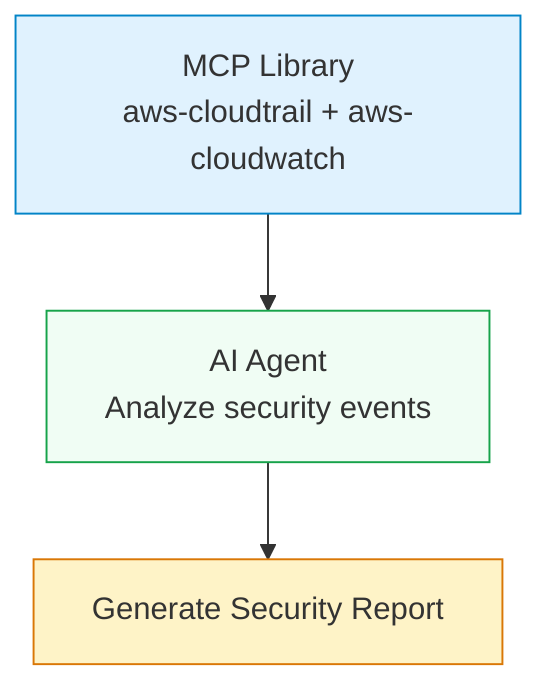
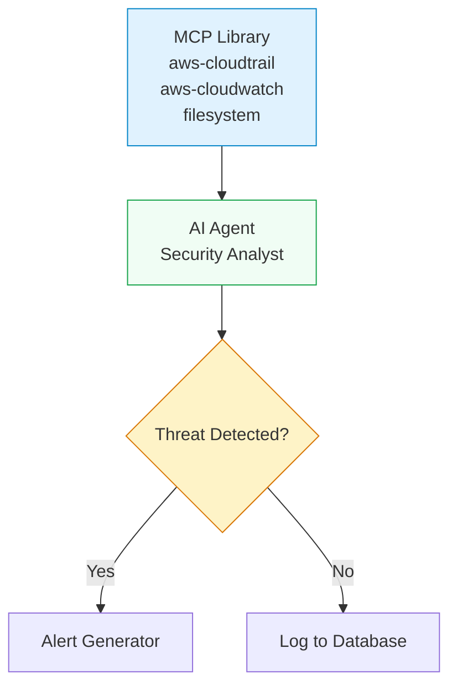

# MCP Library Component

## Overview

The MCP Library component provides a centralized way to select and enable multiple MCP servers without needing individual server nodes in your workflow. It simplifies the process of integrating multiple MCP servers by allowing you to choose from a library of available servers and automatically register their tools with the Tool Registry.

## Key Features

- **Multi-Server Selection**: Choose from available MCP servers through an intuitive interface
- **Automatic Tool Registration**: Tools from selected servers are automatically registered with the Tool Registry
- **Seamless AI Agent Integration**: Works with existing AI Agent components without any modifications
- **Dynamic Server Management**: Fetches server list from backend API with health status and tool counts
- **Docker Container Management**: Automatically spawns and manages containers for stdio servers
- **Docker Registry Catalog**: Browse, search, and import 300+ community MCP servers from Docker's official registry

## Component ID: `core.mcp.library`

## Ports

**Outputs:**

- `tools` (contract: `mcp.tool`) - Anchor port for tool registration. Connect this to AI Agent's tools input.

## Parameters

- `enabledServers` (string[], default: `[]`) - Array of server IDs to enable. Multi-select interface fetches available servers from `/api/v1/mcp-servers`.

## Usage Guide

### 1. Add MCP Library Node

1. Open the workflow editor
2. Drag "MCP Library" from the "MCP" category in the component palette to your canvas
3. The node will appear with a single "tools" output port

### 2. Configure Servers

1. Click on the MCP Library node to open the configuration panel
2. The server list will load from the backend API, showing:
   - Server name and description
   - Health status (healthy/unhealthy/unknown)
   - Number of available tools
   - Enable checkbox for each server

3. Select the servers you want to enable:
   - **AWS CloudTrail** - Query AWS CloudTrail logs for API activity (15 tools)
   - **AWS CloudWatch** - Query AWS CloudWatch metrics and logs (8 tools)
   - **Filesystem** - Read and write local files (6 tools)
   - Additional servers as they become available

4. Click "Save" to apply the configuration

### 3. Connect to AI Agent

1. Drag a connection from the MCP Library's "tools" output port to an AI Agent's "tools" input port
2. The connection will show as a dashed line indicating it's using the `mcp.tool` contract
3. All tools from the selected servers are now available to the AI Agent

## Example Workflows

### Basic AWS Monitoring Workflow

This workflow demonstrates using MCP Library to query AWS CloudTrail and CloudWatch data.



**Steps:**

1. Add MCP Library node and select AWS CloudTrail + CloudWatch servers
2. Add AI Agent node and connect MCP Library tools to AI Agent tools
3. Add a Report Generator node to format the results
4. Configure the AI Agent to ask questions about security events

### Advanced Threat Detection Workflow

This workflow combines multiple MCP servers for comprehensive security analysis.



## Architecture

The MCP Library component follows this execution flow:

1. **Fetch Servers** - Makes GET request to `/api/v1/mcp-servers` to get available servers
2. **Filter Servers** - Only includes servers that are enabled and in the `enabledServers` list
3. **Spawn Containers** - For each stdio server:
   - Starts Docker container with MCP stdio proxy
   - Gets HTTP endpoint (e.g., `http://localhost:12345/mcp`)
4. **Register Tools** - POST to `/internal/mcp/register-local` for each server
5. **Tool Discovery** - AI Agent discovers tools via MCP Gateway

### Integration Points

- **Backend API** - `/api/v1/mcp-servers` (server list with metadata)
- **Internal API** - `/internal/mcp/register-local` (tool registration)
- **Tool Registry** - Redis (stores tool metadata and execution endpoints)
- **MCP Gateway** - `/mcp/gateway` (provides tool discovery/execution interface)

## Credential Management

### AWS Services

For AWS MCP servers (CloudTrail, CloudWatch), credentials are managed through environment variables:

#### Method 1: Environment Variables

```bash
# Set in your environment or docker-compose.yml
AWS_ACCESS_KEY_ID=your-access-key
AWS_SECRET_ACCESS_KEY=your-secret-key
AWS_REGION=us-east-1
AWS_SESSION_TOKEN=your-session-token  # Optional for temporary credentials
```

#### Method 2: Backend Configuration

Add to your backend environment configuration:

```bash
# backend/.env
AWS_ACCESS_KEY_ID=your-access-key
AWS_SECRET_ACCESS_KEY=your-secret-key
AWS_REGION=us-east-1
```

#### Method 3: AWS IAM Roles (Recommended for production)

When running in Docker, assign IAM roles to the containers:

```yaml
# docker-compose.yml
services:
  worker:
    environment:
      - AWS_ROLE_ARN=arn:aws:iam::123456789012:role/SentrisWorkerRole
      - AWS_WEB_IDENTITY_TOKEN_FILE=/var/run/secrets/eks.amazonaws.com/serviceaccount/token
    volumes:
      - /var/run/secrets/eks.amazonaws.com/serviceaccount:/var/run/secrets/eks.amazonaws.com/serviceaccount
```

### Filesystem Server

The filesystem server provides access to:

- Temporary directories for each workflow run
- Shared volumes between containers
- Host file system (when explicitly configured)

**Security Note**: Filesystem access is scoped to the workflow's temporary directory by default for security.

## Server Selection Guide

### Choosing the Right Servers

| Server         | Best For                                               | Tools Available |
| -------------- | ------------------------------------------------------ | --------------- |
| AWS CloudTrail | API activity monitoring, security auditing, compliance | 15 tools        |
| AWS CloudWatch | Metrics, logs, alarms, real-time monitoring            | 8 tools         |
| Filesystem     | File operations, data processing, temp files           | 6 tools         |

### Health Status Indicators

- **Healthy** - Server is responsive and ready to accept requests
- **Unhealthy** - Server is not responding or experiencing issues
- **Unknown** - Health status could not be determined

## Troubleshooting

### Common Issues

**Servers Not Loading**

- Check backend API: `curl http://localhost:3211/api/v1/mcp-servers`
- Verify backend service is running
- Check network connectivity

**Tools Not Available to AI Agent**

- Ensure MCP Library is connected to AI Agent tools port
- Check Tool Registry for registered tools
- Verify MCP Gateway is running

**Container Spawning Failed**

- Check Docker is running and accessible
- Verify image exists: `zebbern/mcp-stdio-proxy:latest`
- Check container resource limits

### Debug Commands

```bash
# Check backend API
curl http://localhost:3211/api/v1/mcp-servers

# Check Tool Registry (if Redis CLI is available)
redis-cli GET tool:registry

# Check running containers
docker ps | grep mcp

# Check MCP Gateway health
curl http://localhost:3211/mcp/gateway/health
```

## Best Practices

1. **Start Small**: Begin with one server and gradually add more
2. **Monitor Health**: Regularly check server health status
3. **Use IAM Roles**: Prefer AWS IAM roles over access keys for production
4. **Resource Limits**: Monitor container resource usage
5. **Network Isolation**: Keep MCP servers isolated from production networks

---

## Docker Registry Catalog

The MCP Library includes a **Docker Registry** tab that gives you access to 300+ community Model Context Protocol (MCP) servers curated by Docker's official MCP Registry. You can browse, search, and import servers directly into your library — no manual configuration required.

### Accessing the Docker Registry

1. Navigate to the **MCP Library** page from the sidebar
2. Click the **Docker Registry** tab (next to "My Library")
3. Browse the full catalog of available community servers

### Browsing and Searching

The Docker Registry tab provides several ways to find servers:

- **Search**: Type a name, description, or tag in the search bar to filter results in real time
- **Category filter**: Select a category to narrow down servers — options include Databases, Cloud, Development, Security, AI/ML, Communication, and Monitoring
- **Server type filter**: Toggle between **All**, **Docker**, or **Remote** to show only container-based or HTTP-based servers

### Featured Servers

Some servers are marked with a gold star badge, indicating they are **curated, security-relevant servers** recommended for common security workflows. Featured servers appear prominently in the catalog.

### Server Types

Each server in the registry has one of two types:

| Type | Label | Description |
|------|-------|-------------|
| `server` | Docker | Container-based MCP server. Sentris automatically pulls and runs the Docker image in an isolated container. |
| `remote` | Remote | HTTP-based MCP server. Sentris connects to a remote URL endpoint using streamable HTTP or SSE transport. |

### Importing a Server

To add a server from the Docker Registry to your library:

1. **Click a server card** (or the "View Details" button) to open the server detail sheet
2. **Review the server details**: description, server type, Docker image or remote URL, required secrets, and environment variables
3. **Fill in required credentials**: Enter any required API keys or tokens. These are encrypted before storage.
4. **Optionally configure environment variables**: Set any additional environment variables the server needs
5. **Click "Import to Library"**: The server is created in your library with encrypted credentials

After import, the server appears in your **My Library** tab. It is fully available for use in workflows and health checks, just like any manually configured server.

### Already Imported Indicator

Servers you have already imported display an **"Already imported"** badge on their catalog card. This prevents accidental duplicate imports and helps you quickly see which servers are already in your library.

### Post-Import Behavior

Once imported, a registry server behaves identically to a manually created MCP server:

- It appears in the **My Library** tab with health status and tool count
- You can enable or disable it for specific workflows
- Docker-type servers have their containers automatically managed
- Remote-type servers connect to their configured HTTP endpoint
- Credentials and environment variables can be updated from the server settings

---

## Registry Sync and Administration

The Docker Registry catalog is automatically synchronized from the upstream GitHub repository (`docker/mcp-registry`). Administrators can monitor and manage the sync process.

### Automatic Sync

The catalog syncs automatically once per day at **3:00 AM UTC**. During sync, new servers are added, removed servers are cleaned up, and existing server metadata is updated.

No action is required — the catalog stays current automatically.

### Manual Sync

Administrators can trigger a sync manually:

```bash
curl -X POST http://localhost/api/v1/mcp-registry/sync \
  -H "Authorization: Bearer <admin-token>"
```

The response includes sync results:

```json
{
  "status": "success",
  "serversAdded": 5,
  "serversUpdated": 12,
  "serversRemoved": 1,
  "totalServers": 312,
  "durationMs": 2340,
  "error": null
}
```

### Sync Status

Check the current sync state:

```bash
curl http://localhost/api/v1/mcp-registry/sync/status \
  -H "Authorization: Bearer <admin-token>"
```

Response fields:

| Field | Description |
|-------|-------------|
| `lastSyncAt` | Timestamp of the last completed sync |
| `lastSyncStatus` | Result of the last sync (`success`, `partial`, `failed`) |
| `serversSynced` | Total servers in the catalog after the last sync |
| `serversAdded` | Number of servers added in the last sync |
| `serversRemoved` | Number of servers removed in the last sync |
| `serversUpdated` | Number of servers updated in the last sync |
| `lastError` | Error message if the last sync failed (otherwise `null`) |

### Registry Environment Variables

Configure these optional environment variables in your backend `.env` file:

```bash
# Optional: GitHub personal access token for registry sync
# Increases GitHub API rate limit from 60 to 5,000 requests/hour
GITHUB_REGISTRY_TOKEN=""

# Optional: Disable automatic daily catalog sync (default: true)
MCP_REGISTRY_SYNC_ENABLED="true"

# Optional: Override the registry GitHub repository (default: docker/mcp-registry)
MCP_REGISTRY_REPO="docker/mcp-registry"
```

| Variable | Required | Default | Description |
|----------|----------|---------|-------------|
| `GITHUB_REGISTRY_TOKEN` | No | — | GitHub personal access token. Increases API rate limit from 60 to 5,000 requests/hour for catalog sync. |
| `MCP_REGISTRY_SYNC_ENABLED` | No | `true` | Set to `false` to disable the daily automatic sync at 3 AM UTC. |
| `MCP_REGISTRY_REPO` | No | `docker/mcp-registry` | Override the GitHub repository used as the registry source. |

<Note>
  Without a `GITHUB_REGISTRY_TOKEN`, sync uses GitHub's unauthenticated rate limit of 60 requests per hour. This is sufficient for the daily sync schedule, but may be insufficient if you trigger manual syncs frequently.
</Note>

## Future Enhancements

- [ ] Custom server registration (add your own MCP servers)
- [ ] Health check polling and alerts
- [ ] Tool exclusion filters
- [ ] Server groups and templates
- [ ] Usage analytics and monitoring

## References

- [MCP Architecture Documentation](/docs/architecture.mdx)
- [AI Agent Component Documentation](/docs/ai-agent.md)
- [Component Development Guide](/docs/components.md)
- [Sentris Flow Architecture](https://github.com/zebbern/Sentris/tree/main/docs)
